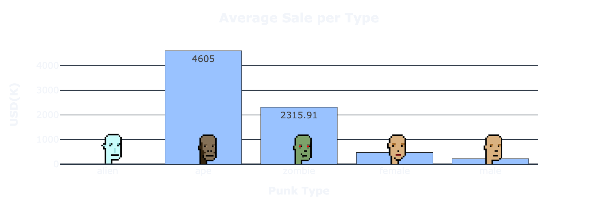
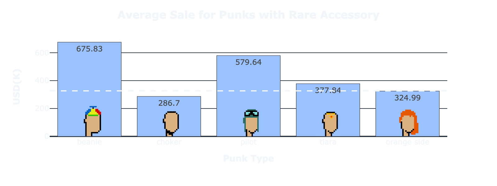

# Capstone: NFT Price Estimator

### Problem Statement
The goal of this project was to estimate the value of each Punk in the CryptoPunks NFT collection of 10,000 pieces using regression modeling, which utilized over 100+ features based on transaction data and attributes, and to determine which attributes (accessories/types) and features are more valuable, and thus, ideal to have in a punk.

Unfortunately, attempting to estimate the value of an individual punk can be confusing, as only 30% of punks have recent (past 6 months) sale data and many have no transaction data since they were claimed. This project was created to aid potential CryptoPunk buyers in estimating the value of a particular punk based on its recent transaction data, accessories, type, accessory count, and punks with similar accessories/types, regardless of whether it has recent sale data or not. In addition, it serves to analyze sale history of punks with particular features (ex. high rarity score, rare accessory/type, low accessory count) and attributes of the highest selling punks to better understand which punks will make for a good investment.

### Executive Summary
The order I took to complete this project was as follows: gather transaction, accessory, and type information on each unique punk in the 10,000 piece collection, create an appliable 10,000 rowed dataframe for the models to be tested, perform exploratory data analysis of features, develop a recommender system to find the 10 most similar punks to each unique punk, create several regerssion models to estimate the value of each punk, and, finally, deploy an application for potential investors to see results of model and gain insights on collection.

To gather data, I used OpenSea's API for the collection's attribute counts (how many punks in the collection had certain accessories or types), a Kaggle dataset to get a description of each unique punk's accessories and type, and lastly LarvaLabs to get the transaction history (bids, sales, transfers, claim, bid withdrawn bids, and withdrawn offers). I then needed to combine all the information into one applicable dataframe of 10,000 rows for the model to use, which included creating new columns. The most important column created was "most recent sale in USD" because this is what the model would attempt to predict. 

After gathering and cleaning the data, I performed thorough exploratory data analysis on the dataset. Specifically, focusing on the relationship betweeen the punks recent transactions and its accessory list/count and type. 

Here are some graphs that demonstrate the average sale price (in the past 6 months) for each type and of punks that have a rare accessory:

As one can see, rare types (aliens, apes, zombies) sell for far more than unrare types (male and female). Similarly, punks that contain rare accessories (beanie, choker, pilot, tiara, orange side) sell for more than the average, which is $326.56K (the dotted white line).

Lastly, Below you can find a graph that demonstrates common accessories among the top 25 highest sold punks: 

Next, I made several models to best estimate the price of each punk. Specifically, the models I used for regression were as follows: Linear, Ridge, Lasso, ElasticNet, K-Neighbors, Decision Tree, Bagging, Random Forest, Ada Boost, Gradient Boost, and Neural Networks. The success of the models were evaluated based on root mean squared errors, a metric used to determine how far away the predicted values are from the actual value. A deep neural networks model was selected as the price estimator as it had the lowest RMSE. 

Finally, to display my estimates, insights, and visualizations, I created a website through Streamlit. The user is able search a punk in the collection by its unique ID number and find its estimated value, rarity score, similar punks, and transaction data since its inception. In addition, the user can also find the highest estimated punks, highest rarity scores, and averages of types and accessories. 

To view the website click here: https://share.streamlit.io/olivialara/nft-price-estimator/main/app/app_main.py

### Contents:

Part I: Gathering Data
- Import Libraries
- Get CryptoPunk Stats & Traits Data from OpenSea's API
- Get Each CryptoPunk's Accessory Information from Kaggle
- Get Each CryptoPunk's Transaction Information from Larva Labs

Part II: Cleaning and Preprocessing
- Import Libraries
- Read In & Inspect Data
- Deal with NaN Values
- Remove Unneeded/Rename Columns and Rows
- Convert Types of Columns
- Add Average and Max Sales, Bids, and Offers from Past 6 Months to Individual Dataset
- Deal with Nan Values For Newly Added Columns
- Add Accessories and Type List to Transactions Dataset
- Add Rarity Scores in Individual Percents Dataset
- Save Clean Dataframes

Part III: Exploratory Data Analysis
- Import Libraries¶
- Read In & Inspect Data
- Analyze Trait Info
- Analyze Accessory Info
- Analyze Rarity Scores
- Analyze Most Expensive Sales
- Analyze Transaction Data
- Analyze Popular Word Charts
- Heatmaps

Part IV: Similarity Score Model
- Import Libraries
- Null Model
- Model Functions for Efficiency
- Testing Models
- Bagging
- Random Forest
- Conclusion

Part V: Scratch Work

### Conclusion

I ended up setting my X value to 100+ features. My best model ended up being **Neural Networks**, which got an RMSE of 69.37, which is notably better than my baseline RMSE of 223.89. The features that are most correlated to estimated value are the recent sale data of the punk and the sale data for that particular type.

Upon analyzing the graphs, I also found that punks that contain rare accessories and are a rare type sell for far more than punks with less rare features. Further, common accessories among the top 25 highest selling punks are as follows: small shades, hoodie, shadow beard, and crazy hair. 

### Furhter Study

In the event that I return to this project, I would like to give the user an option to see estimated values and charts in USD and ETH (ethereum) and  further improve my model.

While utilizing ETH  instead of USD for the model would be ineffective due to ETH's high volatility, it would be beneficial to add the ETH estimated price along with the USD estimated price. The purpose for this is because the punks are sold and purchased using ethereum. Thus, I would like to add an ETH button on my website that would allow users to see USD values in ETH. 

### Sources
- https://moscow25.medium.com/predicting-cryptopunk-prices-the-case-for-jpegs-e4fc0f0fafd1
- https://medium.com/geekculture/cosine-similarity-and-cosine-distance-48eed889a5c4
- https://raritytools.medium.com/ranking-rarity-understanding-rarity-calculation-methods-86ceaeb9b98c
- https://goodboychan.github.io/python/datacamp/natural_language_processing/2020/07/17/04-TF-IDF-and-similarity-scores.html
- https://stackoverflow.com/questions/1894269/how-to-convert-string-representation-of-list-to-a-list
- https://www.kaggle.com/tunguz/cryptopunks-simple-visualization/data
